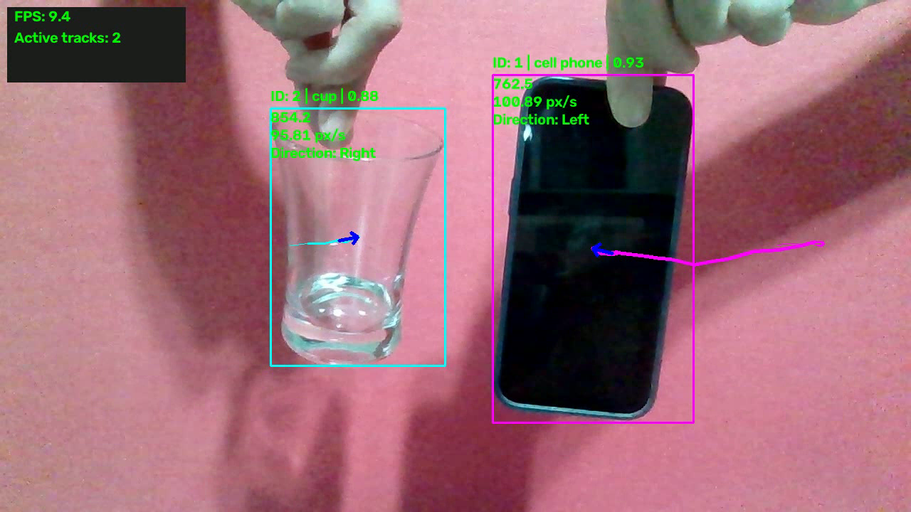

# Object Tracking & Motion Analytics

Webcam-based multi-object tracking with **per-track motion measurements**, annotated video export, and structured session reports. The main application uses Ultralytics YOLOv8n; a classical HSV/OpenCV baseline preserves the project's original color-based approach.

The focus is what happens **after detection**: maintain histories by tracking ID, estimate image-plane speed and direction, accumulate observed distance, handle interrupted observations, and retain a useful session summary.

> All speed and distance values are in **pixels per second (px/s)** and **pixels (px)**. They are not metres, metres per second, or km/h. The application is an educational motion-analysis project, not a calibrated physical measurement system.

## Demo

[Download or open the demo video](examples/demo.mp4) · [View the session JSON](examples/session_example.json)

A real webcam recording of a phone and a drinking glass against a plain background. The example demonstrates two tracking IDs, separate motion histories, direction arrows, and the live FPS/track-count panel. The screenshot is taken directly from the recording; measurements and predicted labels have not been edited.

The supplied recording contains **123 frames at 1280 × 720**, encoded at **30 FPS** for **4.10 seconds of playback**. Its report covers **16.32 seconds of measurement-session time**. These are different clocks: the writer uses fixed-rate playback while analytics use elapsed capture-loop time. Processing, including initial warm-up, is slower than the video playback rate; this is not a real-time-duration video or a 30 FPS performance claim.

The report contains two IDs, but there are brief missed observations and changing class predictions. See [the report explanation](#real-session-example) and [media provenance](examples/README.md). If the MP4 does not play in your browser, download it and use a local video player.

## Features

- YOLO multi-object detection with persistent tracking IDs via `model.track(..., persist=True)`.
- Confidence threshold and optional class filtering.
- Bounding boxes, class names, confidence values, and tracking IDs.
- Separate per-ID trajectories with thicker recent segments and cycling ID colors.
- Speed smoothing over recent observations, dominant-axis direction, and direction arrows.
- Per-ID observed distance and session-wide average speed.
- Track timeout cleanup and short-gap handling that avoids measuring an unobserved jump.
- FPS moving average and the number of currently processed tracks.
- Annotated MP4 recording and timestamped JSON session summaries.

No line-crossing counter, video-file input mode, CLI configuration layer, custom model training, or benchmark framework is implemented.

## Pipeline and code structure

~~~text
Webcam -> horizontal flip -> YOLO detection + persistent tracking
                                  |
                         ID and class filtering
                                  |
                  Per-ID history and gap/timeout handling
                                  |
                   Distance, speed, direction, lifetime
                           /                 \
                 Overlays + MP4         Session summary
                      |                      |
                  Live window         JSON on normal exit
~~~

Each application remains a small, independent script. The main tracking loop is intentionally readable from top to bottom; there is no custom class hierarchy or plugin framework.

- `main()`: capture, tracking, measurements, overlays, recording, and cleanup.
- `draw_text()`: consistent overlay text styling.
- `save_session_report()`: YOLO session metadata and per-ID JSON export.

~~~text
real-time-object-tracking/
├── src/
│   └── yolo_tracker.py
├── baselines/
│   └── hsv_color_tracker.py
├── models/
│   └── README.md
├── examples/
│   ├── README.md
│   ├── demo.mp4
│   ├── screenshot.png
│   └── session_example.json
├── tests/
│   ├── test_yolo_tracker.py
│   └── test_hsv_color_tracker.py
├── docs/
│   └── PORTFOLIO.md
├── requirements.txt
├── LICENSE
├── .gitignore
├── .gitattributes
└── README.md
~~~

Download `models/yolov8n.pt` locally; it is not committed. Automatic recordings and reports stay in the repository root and are ignored by Git. The intentionally selected video, screenshot, and report in `examples/` are the documentation assets.

## Technologies

Python, OpenCV, Ultralytics YOLOv8n, PyTorch, NumPy, and Python's standard-library `deque`, `time`, `datetime`, and `json` modules.

The application does not implement a new detector or association algorithm. It uses the tracking backend selected by the pinned Ultralytics package and adds its own per-ID motion analytics. No tracker override is passed.

## Installation

Use a desktop environment with a working webcam and GUI support.

Developed and run on **Windows / Python 3.13.1**. The pinned NumPy version requires Python 3.12 or newer; Python 3.13 is recommended for this environment.

Download or clone this repository, open a terminal in its root, and create a fresh virtual environment.

### Windows PowerShell

~~~powershell
python -m venv .venv
.\.venv\Scripts\Activate.ps1
python -m pip install -r requirements.txt
~~~

If PowerShell blocks activation, use the environment's interpreter directly instead of changing the machine's execution policy:

~~~powershell
.\.venv\Scripts\python.exe -m pip install -r requirements.txt
~~~

### macOS / Linux

~~~bash
python3 -m venv .venv
source .venv/bin/activate
python -m pip install -r requirements.txt
~~~

The requirements pin the application's principal runtime and tracking dependencies to versions found in the development environment; this is not a full transitive lockfile. Use only `opencv-python` in the fresh environment, not a headless package or multiple competing OpenCV packages. Both applications need `imshow`.

For a hardware-specific PyTorch installation, consult the [official installation guide](https://pytorch.org/get-started/locally/) and [Ultralytics installation notes](https://docs.ultralytics.com/quickstart/). No dependency updates are required merely to run this project.

### Obtain the YOLO weights

If you already have the original `yolov8n.pt`, place it at `models/yolov8n.pt`. Otherwise, run from the repository root:

~~~bash
python -c "from pathlib import Path; from ultralytics import YOLO; YOLO(str(Path('models/yolov8n.pt').resolve()))"
~~~

This uses Ultralytics' pretrained-model loader; an internet connection is required if the weights are missing. It does not start the webcam or train a model. See the [official YOLOv8 documentation](https://docs.ultralytics.com/models/yolov8/) and [model notes](models/README.md).

The baseline does not need model weights. ONNX files left over from earlier experiments are not used by either application.

## Run

Run one application at a time.

**Main YOLO application**

~~~bash
python src/yolo_tracker.py
~~~

**Classical CV baseline**

~~~bash
python baselines/hsv_color_tracker.py
~~~

In PyCharm, select the appropriate script and the virtual environment created above. Both scripts resolve their model/output paths from the repository, not the terminal's current directory.

The main version requests a 1280 × 720 webcam image, then uses the actual dimensions returned by the camera. The HSV baseline retains the camera's default resolution. Camera index is `0` in both versions.

### Existing settings

Settings remain named constants at the top of each script. There is no separate configuration service or command-line argument parser.

| Setting | YOLO default | Purpose |
| --- | --- | --- |
| `CONF_THRESHOLD` | `0.5` | Detection confidence passed to tracking |
| `ALLOWED_CLASSES` | `None` | All classes; `[0]` filters the displayed/analysed results to people |
| `TRAIL_LENGTH` | `30` | Retained center positions per ID |
| `SPEED_WINDOW` | `10` | Recent valid speed samples for the displayed average |
| `DIRECTION_WINDOW` | `6` | Center positions used for direction displacement |
| `MOTION_THRESHOLD` | `10.0` | Still threshold in px/s |
| `TRACK_TIMEOUT` | `2.0` | Seconds before unseen live history is removed |
| `FPS_WINDOW` | `30` | Recent loop intervals included in FPS smoothing |

Class filtering happens after tracking; it is not an inference optimization.

## Controls

Click/focus the OpenCV image window before pressing a key.

| Key | YOLO application | HSV baseline |
| --- | --- | --- |
| `q` | Exit, close the recording, and save the session JSON | Exit and close the recording |
| `r` | Clear motion/report data and restart session timestamps | Clear motion history and accumulated distance |

Reset does **not** reload YOLO or reset its internal ID assignment. It also does not restart the recording or clear the FPS moving average. The video continues across resets; the YOLO report describes only the measurement session since the last reset.

## Video output

- YOLO: `yolo_tracking_output.mp4`
- HSV: `tracking_output.mp4`

Both are written in the repository root using the `mp4v` codec at a fixed **30 FPS**, including all displayed overlays. Each run overwrites its previous video; rename or copy a recording you want to keep before running again.

**Recording FPS is not processing FPS.** If processing is slower or faster than 30 FPS, playback timing can differ from the live session. The MP4 file is not a time-calibrated recording. Codec support also depends on the installed OpenCV build and operating system.

## JSON session report

Only the YOLO version exports `session_YYYYMMDD_HHMMSS.json`, after normal loop termination (`q` or a failed/end-of-stream camera read). An uncaught processing exception still closes resources, but does not reach the report-writing step.

### Real-session example

This is the complete, unedited report from `session_20260911_194803.json`, paired with the restored source recording in [the demo](examples/demo.mp4). It covers **16.32 seconds** and **two tracking IDs**.

- **ID 1:** first recorded as `cell phone`; final accumulated distance **904.4 px**, with **5 temporary losses**.
- **ID 2:** the drinking glass is first recorded as `vase`; final accumulated distance **866.5 px**, with **7 temporary losses**. Later video frames show `cup`.

The final visible distance totals agree with the report at the overlay's one-decimal precision. The screenshot is an earlier frame, so its cumulative totals are lower. The video's **4.10-second playback duration** is not the session duration; see [video output timing](#video-output).

Class labels are model predictions, not manually verified labels. Each summary retains its **first recorded class label**, even if later detections classify the same ID differently. A temporary loss counts a same-ID return after a gap, not an ID switch. Two reported IDs do not establish perfect tracking or prove an ID-switch score of zero. This example is real application output, not ground truth or an accuracy benchmark.

Show the complete session report (2 track IDs)

~~~json
{
    "session": {
        "started_at": "2026-09-11T19:47:47+03:00",
        "ended_at": "2026-09-11T19:48:03+03:00",
        "duration_seconds": 16.323145999995177,
        "unique_track_count": 2
    },
    "tracks": {
        "1": {
            "class_name": "cell phone",
            "first_seen": 0.4601939999993192,
            "last_seen": 13.576828199991724,
            "lifetime_seconds": 13.116634199992404,
            "frames_tracked": 91,
            "total_distance_px": 904.4250291163613,
            "max_smoothed_speed_px_s": 247.3762507323655,
            "measured_seconds": 9.109813600007328,
            "average_speed_px_s": 99.2803002155427,
            "temporary_loss_count": 5
        },
        "2": {
            "class_name": "vase",
            "first_seen": 2.968916999991052,
            "last_seen": 13.576828199991724,
            "lifetime_seconds": 10.607911200000672,
            "frames_tracked": 92,
            "total_distance_px": 866.5462721280627,
            "max_smoothed_speed_px_s": 230.405678728058,
            "measured_seconds": 8.967775199984317,
            "average_speed_px_s": 96.62890213055053,
            "temporary_loss_count": 7
        }
    }
}
~~~

### Field meanings

| Field | Meaning |
| --- | --- |
| `started_at`, `ended_at` | Local date/time with UTC offset, to whole seconds |
| `duration_seconds` | Elapsed measurement-session time from a monotonic clock, not model-loading time |
| `unique_track_count` | Number of report ID keys, **not** guaranteed unique physical objects |
| `class_name` | Class recorded when this ID's summary was first created |
| `first_seen`, `last_seen` | Seconds from the latest session start to the first/last accepted observation |
| `lifetime_seconds` | Last minus first seen; includes intervening periods without observations |
| `frames_tracked` | Number of accepted observations for the ID |
| `total_distance_px` | Sum of accepted consecutive-observation displacements |
| `measured_seconds` | Sum of time intervals paired with those distance samples |
| `average_speed_px_s` | Report distance divided by measured seconds; zero until a valid interval exists |
| `max_smoothed_speed_px_s` | Highest displayed moving-average speed reached in the session |
| `temporary_loss_count` | Same-ID returns after missing processed frames, before its live history times out |

Numeric ID keys become strings in JSON. The current report does **not** contain class-level counts, full-session average FPS, total processed-frame counts, or benchmark metrics.

## How the motion analytics work

1. **Position:** use the integer midpoint of each accepted bounding box.
2. **Displacement:** calculate `sqrt(dx² + dy²)` between consecutive accepted observations of that ID.
3. **Time:** use differences between `time.perf_counter()` timestamps sampled after capture.
4. **Displayed speed:** average the last ten valid `displacement / elapsed_time` samples.
5. **Report speed:** divide accumulated distance by accumulated measured time; this is a time-weighted session value, not the displayed rolling average.
6. **Direction:** compare the newest center with the sixth-most-recent center, choose the dominant image axis, and apply the Still threshold. Image y increases downward. Direction is relative to the horizontally flipped image.
7. **Gaps and lifecycle:** break the live trail/speed history when a processed observation is missing. Remove live ID data after timeout while retaining its report entry.

A temporary return starts with one new center, so it contributes no gap-spanning distance sample. If the same ID returns after timeout, its live displayed distance restarts while its retained report continues accumulating. No unseen path is reconstructed.

FPS is an arithmetic moving average of recent reciprocal loop intervals. It includes capture and application processing effects; it is neither model-only inference speed nor an all-session benchmark.

## Classical CV Baseline

The project began as **HSV color segmentation plus contour-based tracking**, then evolved into YOLO-based multi-object tracking while retaining the motion-analysis concepts.

The baseline selects the single largest green external contour with area strictly greater than 500 pixels². It maintains one center history, direction, smoothed speed, total distance, and TRACKING/LOST/SEARCHING status.

| Feature | HSV Baseline | YOLO Version |
| --- | --- | --- |
| Detection | HSV color thresholding + largest contour | Learned object detection |
| Object classes | Color-dependent target | Multiple semantic classes |
| Multi-object IDs | Not implemented; one selected contour | Persistent IDs supplied by the tracker |
| Robustness | Sensitive to lighting, color, and similar-colored objects | More general; still sensitive to model/domain limitations |
| Motion analytics | One selected target | Separate measurements per tracked ID |
| Recording | Annotated MP4 | Annotated MP4 + session JSON |

Baseline HSV bounds are `[35, 100, 100]` to `[85, 255, 255]`. It ignores steps smaller than 2 px **only when accumulating distance**; speed smoothing still includes those samples. Its short losses retain the previous center, and history is cleared after ten missing frames. Unlike the YOLO version, it does not exclude all short-gap motion samples.

These differences are intentionally preserved. The baseline is a learning/reference implementation, not a competing multi-object tracker or a numerically equivalent benchmark.

## Tests

~~~bash
python -m unittest discover -s tests -v
~~~

The tests need only Python's standard library. They replace the camera, model, clocks, drawing, and output files with deterministic test doubles.

Coverage includes per-ID measurements, short-gap exclusion, loss counts, timeouts, resets, filters, empty observations, history limits, HSV threshold boundaries, and resource cleanup. They verify application logic, **not** real-camera compatibility, model accuracy, codec availability, or measured throughput.

## Known limitations

- Image-plane measurements depend on camera placement, resolution, perspective, and camera movement. There is no metric calibration or depth estimation.
- Bounding-box jitter can accumulate apparent distance and speed even for a stationary object. Speed smoothing does not smooth center positions.
- IDs can change or be reassigned. An ID count is not a people counter; the temporary loss counter is not an ID-switch metric.
- Occlusion, small targets, similar objects, and domain mismatch can interrupt detections or association.
- Tracker defaults depend on the Ultralytics version. The package is pinned, and this application does not explicitly select another tracker.
- Runtime FPS depends on hardware, camera delivery, and scene complexity. No accuracy or benchmark score is claimed.
- Labels can overlap in crowded scenes. The four-color palette repeats.
- Report filenames use second precision, so two saves within the same second can overwrite one another.
- The HSV baseline is particularly lighting-sensitive and may jump between similarly colored objects.
- Webcam input is the only implemented source. There is no offline-video timing or evaluation mode.

## Possible future work — not implemented

- Repeatable offline-video evaluation with source timestamps.
- Ground-truth-based association evaluation and clearly defined performance measurements.
- More representative documentation examples and controlled jitter/error measurements.

These are separate future changes, not features of the current release.

## Licensing and attribution

Ultralytics YOLO software and pretrained models are offered under AGPL-3.0 and alternative commercial licensing. Review the [official licensing terms](https://www.ultralytics.com/license) before distribution or reuse. Not committing model weights does not remove their licensing conditions.

Copyright (c) 2026 SeLiM-974. This project's original source code is licensed under the **GNU Affero General Public License, version 3 only (AGPL-3.0-only)**. See [LICENSE](LICENSE) for the full terms. The software is provided without warranty.

Third-party libraries and model weights remain subject to their respective licenses. This project's license does not replace those terms.

Built with [Ultralytics YOLO](https://docs.ultralytics.com/models/yolov8/), [OpenCV](https://opencv.org/), and [NumPy](https://numpy.org/). The motion-analysis and reporting code is the focus of this project.
